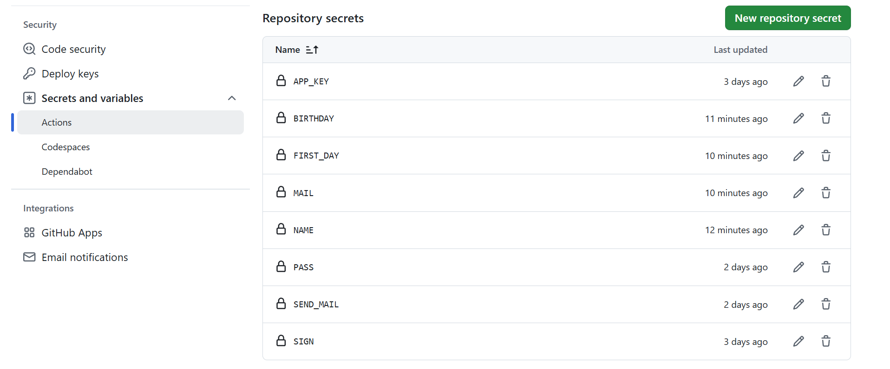

### github 的 Settings

1. PASS ： 邮件账号授权码
2. SEND_MAIL: 自己用于发送邮件的账号
3. APP_KEY: nowApi 的 AppKey
4. SIGN: nowApi 的 Sign
5. MAIL: 接收人列表,多人用','隔开 注意是英文逗号
6. NAME: 名字列表,多人用','隔开 张三，李思 名字和日期一一对应
7. BIRTHDAY: 生日列表,多人用','隔开 阴历接 r 示例 2024-01-28,2002-09-16r
8. FIRST_DAY: 纪念日 示例 2024-01-28

在 Settings 里面 注册

部署流程： https://blog.csdn.net/m0_72642282/article/details/144140200?spm=1001.2014.3001.5502
